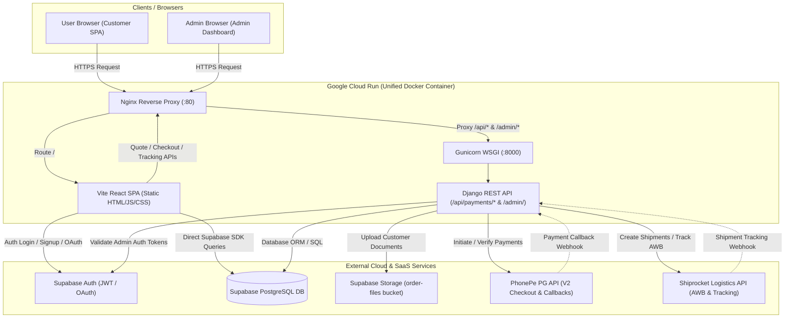

# Project Documentation — Sanjari Prints

## Project Overview

* **Project Name**: Sanjari Prints (Web Platform)
* **Project Type**: Full-Stack E-Commerce & Web-to-Print Web Application
* **Purpose**: Comprehensive online document and book printing platform offering real-time pricing calculation, automated PDF page detection, multi-option print configuration (paper sizes, paper types, color modes, binding, lamination), online payment integration (PhonePe & Razorpay), automated courier logistics and shipment tracking (Shiprocket), customer self-service portal, and comprehensive Administrative Dashboard.
* **Current Status**: Fully developed and deployed in Production
* **Production URL**:
  * Custom Domain: [https://sanjariprint.in](https://sanjariprint.in) / [https://www.sanjariprint.in](https://www.sanjariprint.in)
  * Google Cloud Run URLs:
    * `https://sanjari-prints-873557662000.us-central1.run.app`
    * `https://sanjari-prints-guvt2lfw5a-uc.a.run.app`
* **Repository URL**: `https://github.com/rashidrk201111/sanjari06122025.git` (Private GitHub Repository)

---

## Technology Stack

### Frontend
| Component | Technology | Version | Description |
| :--- | :--- | :--- | :--- |
| **Core Framework** | React | `^18.3.1` | Modern component-based UI library |
| **Language** | TypeScript | `^5.x` | Strongly typed JavaScript |
| **Build Tool** | Vite | `6.3.5` | Next-generation fast frontend tooling |
| **Compiler Plugin** | `@vitejs/plugin-react-swc`| `^3.10.2` | High-performance SWC-based React compilation |
| **Routing** | React Router DOM | `^6.x` (`HashRouter`) | Client-side routing with hash strategy for SPA |
| **UI Components** | Radix UI primitives | `^1.x` / `^2.x` | Accessible headless UI components (`@radix-ui/*`) |
| **Icons** | Lucide React | `^0.487.0` | Comprehensive icon toolkit |
| **Notifications** | Sonner | `^2.0.3` | Toast notifications system |
| **Charts** | Recharts | `^2.15.2` | Data visualization for admin analytics |
| **Carousel** | Embla Carousel React | `^8.6.0` | Product and testimonial sliders |
| **PDF Processing** | `pdfjs-dist` | `^5.7.284` | Client-side PDF page rendering & inspection |
| **Database SDK** | Supabase JS Client | `@supabase/supabase-js` (`^2.49.8`) | Direct client interaction with PostgreSQL & Auth |

### Backend
| Component | Technology | Version | Description |
| :--- | :--- | :--- | :--- |
| **Core Framework** | Django | `>=4.2` | High-level Python web framework |
| **REST API Engine**| Django REST Framework | Latest | Robust toolkit for building Web APIs |
| **Runtime** | Python | `3.11` | Backend programming language runtime |
| **WSGI Server** | Gunicorn | Latest | Production WSGI HTTP server for UNIX |
| **Web Server** | Nginx | Latest (Alpine/Debian) | Reverse proxy, static asset caching, SSL header forwarding |
| **Database Adapter**| `psycopg2-binary` | Latest | PostgreSQL database adapter for Python |
| **Authentication** | Django Auth + Supabase Backend | Custom | Supabase Auth bridge (`SupabaseAdminBackend`) |
| **CORS Middleware** | `django-cors-headers` | Latest | Cross-Origin Resource Sharing management |
| **PDF Inspection** | `pypdf` | Latest | Server-side PDF validation and page count verification |
| **Image Engine** | Pillow | Latest | Image processing and logo thumbnail handling |
| **HTTP Client** | `requests` | Latest | Outbound communication with PhonePe & Shiprocket APIs |

### Infrastructure & Services
| Area | Provider / Tool | Description |
| :--- | :--- | :--- |
| **Database** | Supabase (PostgreSQL 15+) | Cloud PostgreSQL hosted on AWS us-east-1 via Supavisor pooler |
| **Authentication** | Supabase Auth | JWT-based auth, email/password, Google & Facebook OAuth |
| **File Storage** | Supabase Storage | `order-files` storage bucket for uploaded print documents |
| **Container Platform** | Google Cloud Run | Fully managed serverless container runtime (Port 80) |
| **Container Registry** | Google Container Registry (GCR) | Container image repository (`gcr.io`) |
| **CI/CD Pipeline** | Google Cloud Build | Container build & Cloud Run continuous deployment (`cloudbuild.yaml`) |
| **Payment Gateway** | PhonePe V2 PG API | OAuth-based merchant checkout API (UPI, Cards, Net Banking) |
| **Logistics / Courier**| Shiprocket API (v1 external) | Automated shipment booking, label generation, live tracking |

---

## Project Architecture



### Architectural Workflow:
1. **Frontend Layer**: The React SPA handles presentation, interactive product customization (pages, paper types, binding, lamination), dynamic price calculation, and real-time form validations.
2. **Reverse Proxy Layer**: Nginx listens on port 80. Static routes (`/`) serve the compiled React SPA with cache headers. Dynamic routes (`/api/` and `/admin/`) are reverse-proxied to Django running via Gunicorn on `127.0.0.1:8000`.
3. **Backend API Layer**: Django processes checkout quotes, validates pricing server-side, detects PDF page counts using `pypdf`, interfaces with PhonePe for payment tokens, uploads PDFs to Supabase Storage, and communicates with Shiprocket for courier shipment generation.
4. **Data & Storage Layer**: Supabase PostgreSQL serves as the single source of truth for users, products, orders, pricing rules, reviews, and logs. Django connects via PostgreSQL connection string pooler on port 6543.

---

## Directory Structure

```
Sanjari Code 13-05-2026/
├── .agents/                        # IDE & agent workflow configuration
├── .claude/                        # Assistant configuration files
├── .codex/                         # Codex configuration files
├── .dockerignore                   # Docker build ignore rules
├── .env                            # Root environment configuration (Sensitive)
├── .env.example                    # Safe environment template
├── .env.local                      # Local development override file
├── .gcloudignore                   # Google Cloud deploy ignore rules
├── .gitignore                      # Git exclusion rules
├── .npmrc                          # NPM package manager settings
├── app.yaml                        # Google App Engine deployment descriptor
├── backend/                        # Django backend application
│   ├── .env                        # Backend environment configuration (Sensitive)
│   ├── .env.example                # Backend environment template
│   ├── Dockerfile                  # Standalone backend Dockerfile
│   ├── manage.py                   # Django CLI utility
│   ├── media/                      # Local uploaded media storage
│   │   └── uploads/                # User document upload storage
│   ├── payments/                   # Core Django application
│   │   ├── admin.py                # Django Admin site models, forms, custom widgets
│   │   ├── apps.py                 # Django app configuration
│   │   ├── auth_backends.py        # Supabase Admin authentication backend
│   │   ├── management/             # Custom Django management commands
│   │   │   └── commands/
│   │   │       └── sync_frontend_catalog.py # Catalog synchronization command
│   │   ├── migrations/             # Database migration history (0001 - 0005)
│   │   ├── models.py               # Django ORM models & unmanaged Supabase models
│   │   ├── phonepe_client.py       # PhonePe V2 PG API client implementation
│   │   ├── pricing.py              # Server-side pricing calculation engine
│   │   ├── serializers.py          # DRF model serializers
│   │   ├── urls.py                 # Payment & Shiprocket endpoint routing
│   │   └── views.py                # REST API views, webhooks, upload handlers
│   ├── project/                    # Django root project configuration
│   │   ├── settings.py             # Django settings, middleware, database config
│   │   ├── urls.py                 # Root URL configuration
│   │   └── wsgi.py                 # WSGI application entry point
│   ├── requirements.txt            # Python package dependencies
│   └── templates/                  # Custom Django Admin templates
│       └── admin/
│           ├── base_site.html      # Custom admin header styling
│           ├── index.html          # Custom admin dashboard layout
│           └── login.html          # Custom admin login form
├── build/                          # Compiled production frontend assets (Vite output)
├── cloudbuild.yaml                 # Google Cloud Build CI/CD workflow definition
├── docker-compose.yml              # Local multi-container Docker Compose definition
├── docker-compose.backend.yml      # Local backend development Docker Compose
├── Dockerfile                      # Production multi-stage Docker build (Nginx + Django)
├── Dockerfile.cloudrun             # Cloud Run specific Docker configuration
├── index.html                      # Single Page Application HTML entry point
├── netlify.toml                    # Netlify deployment & redirect configuration
├── nginx.conf                      # Nginx reverse proxy & static serving configuration
├── package.json                    # Frontend dependencies & NPM scripts
├── package-lock.json               # Frontend exact package lock
├── start.sh                        # Container startup script for Nginx
├── src/                            # React frontend application source code
│   ├── assets/                     # Static images, product visuals, banners
│   ├── components/                 # Reusable React components
│   │   ├── admin/                  # Admin dashboard tab modules
│   │   │   ├── PaymentSettingsTab.tsx
│   │   │   ├── ReviewsTab.tsx
│   │   │   ├── SEOSettingsTab.tsx
│   │   │   └── ShiprocketSettingsTab.tsx
│   │   ├── ui/                     # Radix UI wrapper components (buttons, dialogs, inputs)
│   │   ├── Navbar.tsx              # Site navigation bar
│   │   ├── Footer.tsx              # Site footer with links & contact info
│   │   ├── Hero.tsx                # Homepage hero banner & callouts
│   │   ├── PriceCalculator.tsx     # Interactive print price calculation wizard
│   │   ├── PricingRuleDialog.tsx   # Admin pricing rule editor modal
│   │   ├── SEOHead.tsx             # Dynamic SEO metadata injector
│   │   └── ValidatedInput.tsx      # Form input validation component
│   ├── context/                    # React Context State Providers
│   │   ├── AdminContext.tsx        # Admin dashboard state & API operations
│   │   ├── AuthContextSupabase.tsx # Supabase customer auth state
│   │   └── CartContext.tsx         # Shopping cart state & local persistence
│   ├── data/                       # Static dataset definitions
│   │   └── categories.ts           # Print categories & subcategories
│   ├── lib/                        # Client libraries & utility clients
│   │   ├── adminAuthHeaders.ts     # Supabase admin authorization header builder
│   │   ├── apiBase.ts              # Dynamic API base URL resolver
│   │   ├── paymentsApi.ts          # Payment & Quote HTTP client
│   │   └── supabase.ts             # Supabase JS client instance & TypeScript types
│   ├── pages/                      # Page level React components
│   │   ├── AboutPage.tsx           # Company about page
│   │   ├── AdminDashboardPage.tsx  # Unified Admin management dashboard
│   │   ├── AdminLoginPage.tsx      # Admin authentication page
│   │   ├── AllProductsPage.tsx     # Product catalog browsing page
│   │   ├── CartPage.tsx            # Shopping cart overview
│   │   ├── CheckoutPage.tsx        # Multi-step checkout & payment flow
│   │   ├── HomePage.tsx            # Main landing page
│   │   ├── LoginPage.tsx           # Customer login page
│   │   ├── SignupPage.tsx          # Customer registration page
│   │   ├── ProductDetailPage.tsx   # Detailed product view
│   │   ├── TrackOrderPage.tsx      # Customer shipment tracking portal
│   │   └── UserDashboardPage.tsx   # Customer profile & order history dashboard
│   ├── App.tsx                     # Main React application & route mapping
│   ├── main.tsx                    # React DOM mounting entry point
│   ├── index.css                   # Global styling and Tailwind directives
│   └── supabase-schema-CORRECT.sql # PostgreSQL database schema definitions
└── vite.config.ts                  # Vite build tool and module alias configuration
```

---

## Database

### Database Architecture & Provider
* **Provider**: Supabase (Managed PostgreSQL 15+)
* **Access Mode**:
  * **Frontend**: Direct REST API & Realtime access via `@supabase/supabase-js` using Row Level Security (RLS).
  * **Backend**: Direct PostgreSQL connection via `psycopg2-binary` through Supavisor Connection Pooler (Port 6543).
  * **Local Development Fallback**: SQLite (`db.sqlite3` / `backend/db.sqlite3`).

### Database Tables Summary

#### 1. `public.users`
* **Purpose**: Customer and staff profile records linked to Supabase Auth (`auth.users`).
* **Columns**: `id` (UUID, PK, FK auth.users), `email` (TEXT), `name` (TEXT), `phone` (TEXT), `role` (`user` | `admin` | `staff`), `email_verified` (BOOLEAN), `created_at` (TIMESTAMPTZ), `updated_at` (TIMESTAMPTZ).
* **Security**: RLS enabled. Users can read/update their own profile; Admins have full access.

#### 2. `public.products`
* **Purpose**: Product catalog items displayed on the store.
* **Columns**: `id` (UUID, PK), `category` (TEXT), `subcategory` (TEXT), `name` (TEXT), `description` (TEXT), `base_price` (NUMERIC), `image_url` (TEXT), `specifications` (JSONB), `created_at` (TIMESTAMPTZ), `updated_at` (TIMESTAMPTZ).
* **Security**: Public read access; Admin/Staff write access.

#### 3. `public.orders`
* **Purpose**: Primary customer orders recorded across store.
* **Columns**: `id` (UUID, PK), `user_id` (UUID, FK users), `order_number` (TEXT, UNIQUE), `items` (JSONB), `total_amount` (NUMERIC), `status` (`pending`, `processing`, `shipped`, `delivered`, `cancelled`), `shipping_address` (JSONB), `payment_method` (TEXT), `payment_status` (`pending`, `completed`, `failed`), `tracking_number` (TEXT), `tracking_url` (TEXT), `estimated_delivery` (TEXT), `created_at` (TIMESTAMPTZ), `updated_at` (TIMESTAMPTZ).
* **Security**: Users can view their own orders; Admins can manage all orders.

#### 4. `public.pricing_rules`
* **Purpose**: Dynamic hierarchical pricing rules per category/subcategory.
* **Columns**: `id` (UUID, PK), `category` (TEXT), `subcategory` (TEXT), `rules` (JSONB), `created_at` (TIMESTAMPTZ), `updated_at` (TIMESTAMPTZ).
* **Rules Schema**: Contains base prices, paper sizes (`paperSizes`), paper types (`paperTypes`), color types (`colorTypes`), side types (`sideTypes`), binding options (`bindingTypes`), cover options (`coverTypes`), lamination options (`laminationTypes`), and volume discount tiers (`quantityDiscounts`).

#### 5. `public.faqs`
* **Purpose**: Frequently asked questions displayed on the store.
* **Columns**: `id` (UUID, PK), `question` (TEXT), `answer` (TEXT), `category` (TEXT), `order_index` (INTEGER), `created_at` (TIMESTAMPTZ), `updated_at` (TIMESTAMPTZ).

#### 6. `public.reviews`
* **Purpose**: Customer feedback and star ratings.
* **Columns**: `id` (UUID, PK), `user_id` (UUID, FK users), `user_name` (TEXT), `user_email` (TEXT), `rating` (INTEGER 1-5), `review_text` (TEXT), `status` (`pending`, `approved`, `rejected`), `created_at` (TIMESTAMPTZ), `updated_at` (TIMESTAMPTZ).

#### 7. `public.seo_settings`
* **Purpose**: Custom SEO title, meta description, and keywords per route.
* **Columns**: `id` (UUID, PK), `page_path` (TEXT, UNIQUE), `title` (TEXT), `description` (TEXT), `keywords` (TEXT), `og_image` (TEXT), `canonical_url` (TEXT), `created_at` (TIMESTAMPTZ), `updated_at` (TIMESTAMPTZ).

#### 8. `public.payment_gateway_settings`
* **Purpose**: Toggle and configure payment gateways (PhonePe, Razorpay, COD).
* **Columns**: `id` (UUID, PK), `razorpay_enabled` (BOOLEAN), `razorpay_key_id` (TEXT), `razorpay_key_secret` (TEXT), `phonepe_enabled` (BOOLEAN), `phonepe_merchant_id` (TEXT), `phonepe_salt_key` (TEXT), `phonepe_salt_index` (TEXT), `cod_enabled` (BOOLEAN), `created_at` (TIMESTAMPTZ), `updated_at` (TIMESTAMPTZ).

#### 9. `public.content_pages`
* **Purpose**: Dynamic page content for static information pages.
* **Columns**: `id` (UUID, PK), `page_type` (TEXT, UNIQUE), `title` (TEXT), `content` (TEXT), `created_at` (TIMESTAMPTZ), `updated_at` (TIMESTAMPTZ).

#### 10. `public.admin_audit_logs`
* **Purpose**: Complete audit trail of admin actions (pricing modifications, status updates, exports).
* **Columns**: `id` (UUID, PK), `admin_id` (UUID), `admin_email` (TEXT), `admin_name` (TEXT), `action` (TEXT), `details` (JSONB), `created_at` (TIMESTAMPTZ).

#### 11. Backend Django-Specific Tables (`payments_*`)
* `payments_order`: Django backend order mirror.
* `payments_fileitem`: Uploaded file line items linked to orders.
* `payments_payment`: Payment gateway transaction audit logs.
* `payments_sitesetting`: Site settings key-value store (packaging charge, shipping charge, logo URL).
* `payments_shiprocketsettings`: Shiprocket credentials and warehouse address.
* `payments_shiprockettoken`: Cached Shiprocket JWT access token.
* `payments_shiprocketshipment`: AWB numbers, courier names, label and manifest URLs.
* `payments_shiprocketlog`: Shiprocket webhook and API event audit logs.

### Database Functions & Triggers
* `update_updated_at_column()`: PL/pgSQL trigger function automatically updating the `updated_at` column upon row modifications across all tables.
* `create_user_profile()`: PL/pgSQL function executing with `SECURITY DEFINER` privileges to safely create a user record in `public.users` immediately upon Supabase Auth registration.

---

## Authentication

### User Authentication Architecture
* **Customer Authentication**: Powered by Supabase Auth (`supabase.auth`).
  * Email and Password login/registration.
  * Social OAuth Login: Google and Facebook OAuth integration.
  * Password Reset: Triggered via `supabase.auth.resetPasswordForEmail()`.
  * Session Handling: Stored securely in browser `localStorage`, with automatic token refresh and session persistence.
* **Admin Authentication**:
  * Frontend Admin Portal (`/#/admin/login` & `/#/admin/dashboard`): Verifies that authenticated user has `role = 'admin'` or `role = 'staff'` in `public.users`. All administrative API calls send the Supabase JWT token as a Bearer token in the `Authorization` header.
  * Django Admin (`/admin/`): Utilizes custom `SupabaseAdminBackend` (`backend/payments/auth_backends.py`), enabling administrators to log in using their Supabase email and password. The backend queries Supabase Auth token endpoint and matches the user's admin role before creating/syncing a local Django superuser session.

### Role-Based Access Control (RBAC)
* `user`: Standard customer access (browse catalog, calculate prices, place orders, view order history).
* `staff`: Operational staff access (view orders, update shipment statuses, create Shiprocket shipments).
* `admin`: Complete administrative control (modify pricing rules, adjust payment gateway settings, create staff accounts, view audit logs).

---

## API Integrations

| Integration | Purpose | Location in Code | Required Variables | Webhook / API Details |
| :--- | :--- | :--- | :--- | :--- |
| **PhonePe PG V2** | Payment Token Generation, Checkout Redirection, Status Checks | [`backend/payments/phonepe_client.py`](file:///c:/Users/tdsdi/Desktop/Sanjari%20Code%2013-05-2026/backend/payments/phonepe_client.py), [`backend/payments/views.py`](file:///c:/Users/tdsdi/Desktop/Sanjari%20Code%2013-05-2026/backend/payments/views.py) | `PHONEPE_CLIENT_ID`, `PHONEPE_CLIENT_SECRET`, `PHONEPE_CLIENT_VERSION`, `PHONEPE_SANDBOX` | OAuth token: `/apis/identity-manager/v1/oauth/token`<br>Pay: `/apis/pg/checkout/v2/pay`<br>Status: `/apis/pg/checkout/v2/order/{id}/status`<br>Webhook: `POST /api/payments/callback/` |
| **Shiprocket Logistics** | Automated Shipment Booking, AWB Generation, Label/Manifest, Tracking | [`backend/payments/views.py`](file:///c:/Users/tdsdi/Desktop/Sanjari%20Code%2013-05-2026/backend/payments/views.py#L947-L1600) | `SHIPROCKET_ENABLED`, `SHIPROCKET_EMAIL`, `SHIPROCKET_PASSWORD`, `SHIPROCKET_WEBHOOK_SECRET` | Auth: `POST /v1/external/auth/login`<br>Create: `POST /v1/external/orders/create/adhoc`<br>AWB: `POST /v1/external/courier/assign/awb`<br>Track: `GET /v1/external/courier/track/awb/{awb}`<br>Webhook: `POST /api/payments/shiprocket/webhook/` |
| **Supabase Storage** | Public & Secure Storage of Customer PDF documents | [`backend/payments/views.py`](file:///c:/Users/tdsdi/Desktop/Sanjari%20Code%2013-05-2026/backend/payments/views.py#L45-L93) | `SUPABASE_URL`, `SUPABASE_SERVICE_ROLE_KEY`, `SUPABASE_UPLOAD_BUCKET` | Upload: `POST /storage/v1/object/{bucket}/{path}` |
| **Supabase REST & Auth** | Realtime database querying, user profile resolution, admin role validation | [`src/lib/supabase.ts`](file:///c:/Users/tdsdi/Desktop/Sanjari%20Code%2013-05-2026/src/lib/supabase.ts), [`backend/payments/auth_backends.py`](file:///c:/Users/tdsdi/Desktop/Sanjari%20Code%2013-05-2026/backend/payments/auth_backends.py) | `SUPABASE_URL`, `SUPABASE_ANON_KEY`, `SUPABASE_SERVICE_ROLE_KEY` | Auth Token: `POST /auth/v1/token`<br>User Profile: `GET /auth/v1/user`<br>REST API: `GET/POST /rest/v1/*` |
| **Razorpay (Configured)** | Alternative credit card / UPI gateway | [`src/components/admin/PaymentSettingsTab.tsx`](file:///c:/Users/tdsdi/Desktop/Sanjari%20Code%2013-05-2026/src/components/admin/PaymentSettingsTab.tsx) | `VITE_RAZORPAY_KEY_ID`, `RAZORPAY_KEY_SECRET` | Client checkout script integration |

---

## CSV / Excel / External Data

### Identification & Analysis
* **Origin of Data**: The system does not depend on static imported CSV/Excel data files for catalog operation. The product taxonomy and pricing options are dynamically initialized via codebase catalog definitions (`src/data/categories.ts`) and Django commands (`sync_frontend_catalog.py`).
* **CSV Export Capabilities**:
  * **Orders Export**: Admin Dashboard allows exporting filtered or selected customer orders to formatted `.csv` files directly in the browser via `AdminDashboardPage.tsx`.
  * **Audit Logs Export**: Admin Dashboard allows exporting administrative audit logs to `.csv` files for compliance and activity tracking.
* **Catalog Synchronization**:
  * Executed on container startup: `python manage.py sync_frontend_catalog`
  * Creates missing `Product` and `PricingRule` entries in Supabase PostgreSQL matching frontend categories if not already present.
* **Data Lifecycle**: Dynamic data created via user interactions (orders, user signups, reviews) and administrative configurations (pricing rules, shipping settings) stored in PostgreSQL.

---

## Environment Variables Overview

All environment variables have been cataloged and separated into local development, staging, production, and third-party services in [`ENVIRONMENT_VARIABLES.md`](file:///c:/Users/tdsdi/Desktop/Sanjari%20Code%2013-05-2026/ENVIRONMENT_VARIABLES.md).

Template files provided without secrets:
* Root Template: [`.env.example`](file:///c:/Users/tdsdi/Desktop/Sanjari%20Code%2013-05-2026/.env.example)
* Backend Template: [`backend/.env.example`](file:///c:/Users/tdsdi/Desktop/Sanjari%20Code%2013-05-2026/backend/.env.example)

---

## Deployment Summary

The project is deployed to **Google Cloud Run** using a unified multi-stage Docker container managed by **Google Cloud Build**.

* **Container Port**: 80 (Nginx)
* **Internal Proxy**: Nginx forwards `/api/*` and `/admin/*` to Gunicorn on `127.0.0.1:8000`
* **Static Assets**: Nginx serves compiled SPA from `/usr/share/nginx/html`
* **Deployment Details**: Full instructions, DNS mappings, container lifecycles, and Cloud Build pipeline documented in [`DEPLOYMENT.md`](file:///c:/Users/tdsdi/Desktop/Sanjari%20Code%2013-05-2026/DEPLOYMENT.md).

---

## Local Setup Summary

Complete developer onboarding and local execution steps are documented in [`SETUP.md`](file:///c:/Users/tdsdi/Desktop/Sanjari%20Code%2013-05-2026/SETUP.md).

---

## Important Files Table

| File | Purpose | Safe to Commit? |
| :--- | :--- | :--- |
| `package.json` | Frontend dependencies and build scripts | ✅ SAFE |
| `vite.config.ts` | Frontend build configuration & aliases | ✅ SAFE |
| `nginx.conf` | Web server & reverse proxy configuration | ✅ SAFE |
| `Dockerfile` | Multi-stage production container definition | ✅ SAFE |
| `Dockerfile.cloudrun` | Cloud Run container definition | ✅ SAFE |
| `cloudbuild.yaml` | Cloud Build pipeline (Contains hardcoded secrets — Must be cleaned) | ⚠️ SENSITIVE / NEEDS ROTATION |
| `backend/project/settings.py`| Django settings configuration | ✅ SAFE |
| `backend/payments/views.py` | API views and webhook receivers | ✅ SAFE |
| `backend/payments/pricing.py`| Pricing calculation logic | ✅ SAFE |
| `src/supabase-schema-CORRECT.sql`| Database schema migration script | ✅ SAFE |
| `.env` | Root production/local environment variables | ❌ **NOT SAFE TO COMMIT** |
| `.env.local` | Local development environment overrides | ❌ **NOT SAFE TO COMMIT** |
| `backend/.env` | Backend production/local environment variables | ❌ **NOT SAFE TO COMMIT** |
| `db.sqlite3` / `backend/db.sqlite3`| Local SQLite databases | ❌ **NOT SAFE TO COMMIT** |
| `cloud_run_logs.txt` | Cloud Run debug execution logs | ❌ **NOT SAFE TO COMMIT** |
| `backend/media/uploads/` | Uploaded customer PDF print documents | ❌ **NOT SAFE TO COMMIT** |
| `.env.example` | Safe environment variable template | ✅ SAFE |
| `README.md` | General project overview | ✅ SAFE |
| `PROJECT_DOCUMENTATION.md` | Comprehensive architectural documentation | ✅ SAFE |
| `SETUP.md` | Developer local setup instructions | ✅ SAFE |
| `DEPLOYMENT.md` | Deployment operations manual | ✅ SAFE |
| `ENVIRONMENT_VARIABLES.md` | Environment variables catalog | ✅ SAFE |
| `PROJECT_INVENTORY.md` | Final audit checklist and inventory | ✅ SAFE |

---

## Security Audit & Recommendations

### 1. Hardcoded Secrets in `cloudbuild.yaml`
* **Discovery**: `cloudbuild.yaml` contains plaintext production secrets in the `--set-env-vars` argument (Django secret key, Supabase database password connection string, Supabase service role key, PhonePe client secret, and Shiprocket password).
* **Action Required**:
  1. Rotate the exposed Supabase database password, Supabase service role key, PhonePe client secret, and Shiprocket password.
  2. Transition to Google Cloud Secret Manager or Cloud Build substitution variables (`${_SECRET_NAME}`) instead of hardcoding values in `cloudbuild.yaml`.

### 2. Hardcoded Supabase Credentials in Source Code
* **Discovery**: `src/lib/supabase.ts` and `src/utils/supabase/info.tsx` have hardcoded Supabase project URL and Anon key.
* **Observation**: While the Supabase `anon` key is designed for public client usage protected by Row Level Security (RLS), it is recommended to load these values from `import.meta.env.VITE_SUPABASE_URL` and `import.meta.env.VITE_SUPABASE_ANON_KEY`.

### 3. Database Credentials & Local Files
* `.env` files in root and `backend/` contain live connection strings and credentials.
* **Resolution**: Ensure all `.env`, `.env.*` (except `.env.example`), `db.sqlite3`, `backend/media/uploads/`, and `cloud_run_logs.txt` are strictly ignored by `.gitignore`.
